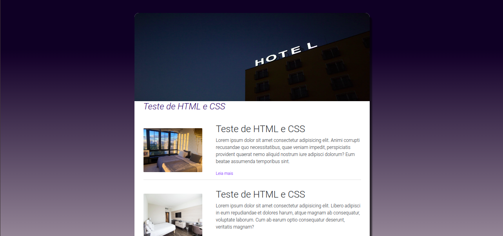
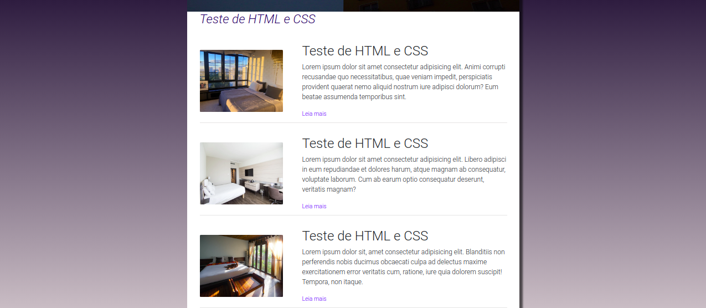
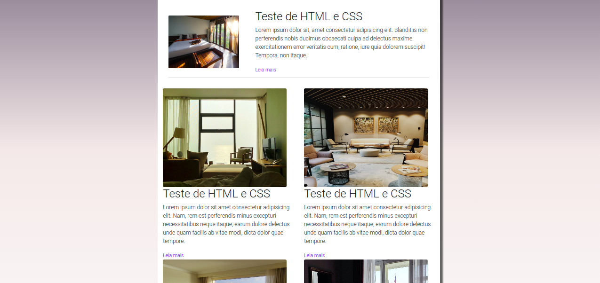
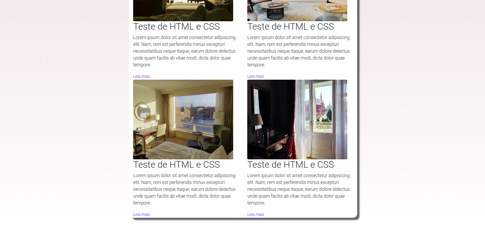

# Teste HTML + CSS + Bootstrap

## Descrição
Desafio técnico para apresentar conhecimentos em frontend o qual objetivo era desenvolver / recriar um layout enviado pela empresa, utilizando html, css e bootstrap.

Fiz a troca de algumas cores e imagens mas o layout e padronização dos grids solicitado foi mantido.

## Uso
Para rodar a aplicação na sua máquina, você deverá clonar o repositório e ou abrir a pasta dos arquivos no VScode e abrir o projeto utilizando a extensão Live Server ou poderá abrir a pasta do projeto e abrir o arquivo teste.html. Ambos deverão abrir a página do projeto no seu navegador preferido. 

## Imagens:

  

  

  

  

## Vídeo - Gif

  

